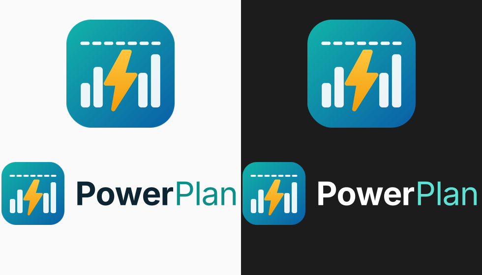

# PowerPlan

Home Assistant custom integration that steers flexible loads by price and by grid capacity tariff.

- Design: [design/HLD.md](design/HLD.md) · per-domain LLDs in [design/lld/](design/lld/)
- Plan: [design/PLAN.md](design/PLAN.md) · contributing: [CONTRIBUTING.md]
- Status: design complete, implementation starting at WP0.1. No code yet.

## Known limitations

- HACS's store listing shows a blank icon for PowerPlan: HACS reads icons from the brands CDN, and PowerPlan ships its brand inside the integration, which Home Assistant 2026.3+ shows on the integration page, device pages and pickers ([hacs/integration#5171](https://github.com/hacs/integration/issues/5171)).
