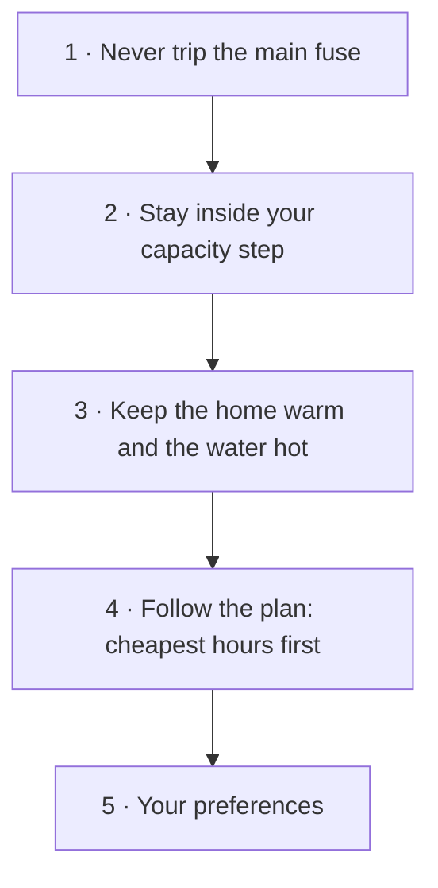

# D14: User documentation

| | |
|---|---|
| Scope | The pages a household and an automator read under `docs/`, the words and markdown they are written in, every place the integration links to them, the tooling that generates and checks them, and the rules that keep them current. |
| HLD | §6.14 (new, with this LLD); §7 (a cross-cutting line: the pages are part of the surface) |
| Depends on | D8 (flows, entities, actions, events, repairs, i18n), D12 (dashboard), D13 (the country and source registries, and the credit note its §6.1 puts in the user docs), and the registries the pages mirror: D1 formats and modifiers, D2 rule templates, D4 device types and profiles, D5 strategies |

---

## 1. Scope and non-scope

| reader | knows | comes for | arrives from |
|---|---|---|---|
| **Household** (primary) | its bill, roughly what a fuse is, which appliances draw a lot; nothing about windows, carriers, COP or baselines (UX review §0) | setting up, understanding a screen, fixing a repair | a flow step's link, a repair's **Learn more**, the dashboard, HACS |
| **Automator** | HA automations, YAML, entity ids | entities, actions, events, examples | the index, search |
| Contributor | Python, HA internals | adding a country module, a price format, a profile | `CONTRIBUTING.md`, `design/` |

**In scope:** the user pages under `docs/`, the root `README.md` (what HACS renders), the link surfaces in §5.4, `tools/docs.py`, `tests/docs/`, and the docs rules in `CONTRIBUTING.md`.

**Not in scope:** the design documents (HLD, LLDs, PLAN, DECISIONS, reviews, benchmarks), which keep their audience and their style. Translated pages (English only). A docs website (§10).

---

## 2. Research and decisions

### 2.1 What larger integrations do

| project | where the docs live | built with | taken here | left |
|---|---|---|---|---|
| HA core integration pages | home-assistant.io, one page per integration | Jekyll | the section order: introduction and use case, supported devices, prerequisites, configuration, options, supported functions, actions, examples, data updates, known limitations, troubleshooting, removal ([integration page structure](https://developers.home-assistant.io/docs/documenting/integration-docs-examples/)); troubleshooting as symptom → description → resolution ([developers PR #3359](https://github.com/home-assistant/developers.home-assistant/pull/3359)); the style guide (§5.1, [general style guide](https://developers.home-assistant.io/docs/documenting/general-style-guide)) | `` tags, which GitHub does not render; "avoid the use of tables" (§5.2 deviates for reference pages); troubleshooting collapsed into `` (§11 12) |
| Powercalc | [docs.powercalc.nl](https://docs.powercalc.nl/) | MkDocs Material | Quick start kept apart from the reference; a *Library* (device catalogue); a *Cookbook* of use cases; FAQ under troubleshooting | a site to build and deploy |
| Octopus Energy (BottlecapDave) | `_docs/` in the repository, published with MkDocs | MkDocs | one heading per entity with its id pattern in code and an *Attribute · Type · Description* table; "disabled by default" linked to one FAQ entry ([electricity.md](https://github.com/BottlecapDave/HomeAssistant-OctopusEnergy/blob/develop/_docs/entities/electricity.md)) | `!!! note` admonitions, which show as literal text when the file is read on GitHub |
| Adaptive Lighting | README only | markdown-code-runner | the options table **generated from the integration's own schema** between `<!-- OUTPUT:START -->` markers; collapsible automation examples; My Home Assistant buttons ([README](https://github.com/basnijholt/adaptive-lighting)) | one very long page |
| Waste Collection Schedule | `doc/` in the repository, read on GitHub | - | one page per source under `doc/source/`, and a `page_template.md` that contributors copy ([doc/](https://github.com/mampfes/hacs_waste_collection_schedule/tree/master/doc)) | - |
| evcc | [docs.evcc.io](https://docs.evcc.io/en/features/solar-charging) | Docusaurus | Features, Devices, Tariffs & forecasts, Reference and FAQ kept apart; a device catalogue separate from the features; a table and a screenshot on each feature page | - |
| Predbat | [springfall2008.github.io/batpred](https://springfall2008.github.io/batpred/) | MkDocs | a "taster" of annotated screenshots before any configuration | - |
| Battery Notes | [codechimp.org/HA-Battery-Notes](https://codechimp.org/HA-Battery-Notes/) | MkDocs | *Get started*, then actions, events and entities as a reference | - |

Five patterns recur. P1: a start path kept apart from the reference (all eight). P2: a catalogue of supported devices and sources (Powercalc, evcc, Waste Collection Schedule). P3: one heading per entity, action and event, with its id (Octopus, Battery Notes). P4: troubleshooting entries with stable anchors (HA, Powercalc). P5: facts generated from the code (Adaptive Lighting). Most of the large integrations publish a site. The ones read on GitHub keep to plain markdown.

**What GitHub and HACS render** (the constraints §5.2 is built on):

| fact | source |
|---|---|
| Five alerts (NOTE, TIP, IMPORTANT, WARNING, CAUTION). "Limit them to one or two per article", "avoid placing alerts consecutively", "cannot be nested within other elements" | [GitHub: basic writing and formatting](https://docs.github.com/en/get-started/writing-on-github/getting-started-with-writing-and-formatting-on-github/basic-writing-and-formatting-syntax) |
| Custom anchors are written `<a name="…"></a>`. A heading's own id is its text lowercased, with spaces turned into hyphens and punctuation dropped. A duplicate heading gets `-1`, `-2` | same |
| Every rendered markdown file gets an **Outline** (a table of contents built from its headings) | [GitHub: about READMEs](https://docs.github.com/en/repositories/managing-your-repositorys-settings-and-features/customizing-your-repository/about-readmes) |
| `<picture>` switches images by light and dark theme on GitHub. **HACS shows it as text** | same; [hacs/integration#4440](https://github.com/hacs/integration/issues/4440) |
| HACS resolves a relative image path against the HA page, so the image breaks. Absolute URLs work | [meshmonitor PR #18](https://github.com/X-Faktor-Technologies/home-assistant-meshmonitor/pull/18) |
| Mermaid, math, footnotes, task lists and `<details>` render in `.md` files | GitHub docs above |
| HA's markdown (flow descriptions, the markdown card) is marked.js with GFM. The markdown card has `<ha-alert>`. GitHub's `> [!NOTE]` syntax is not documented there | [markdown card](https://www.home-assistant.io/dashboards/markdown/) |
| My Home Assistant links: `integration/?domain=`, `config_flow_start/?domain=`, `hacs_repository/?owner=&repository=&category=`, `repairs`, `config_energy`, `lovelace_dashboards`, `logs`, `system_health` | [my.home-assistant.io FAQ](https://my.home-assistant.io/faq/) |
| MkDocs Material renders GitHub's alert syntax through `markdown-callouts`, so pages written for GitHub move to a site unchanged | [markdown-callouts](https://oprypin.github.io/markdown-callouts/index.html) |

### 2.2 Decisions

| # | decision | rule | revises |
|---|---|---|---|
| 1 | **`docs/` is the household's folder** | Only the user pages live under `docs/`. The design documents (`HLD.md`, `PLAN.md`, `DECISIONS.md`, `lld/`, `reviews/`, `benchmarks/`) move to `design/` at the repository root. The move is one idempotent path rewrite across the 137 files that cite them (at `386e5ee`: 87 under `custom_components/`, 30 under `tests/`). DOC.1 runs it when no branch is open, or each open branch re-runs it before it merges | dec. 23: "the design documents keep their paths". Accepted |
| 2 | **Four kinds of page** | *Start* (tutorial), *Guides* (how-to), *Reference* (catalogues), *Understand* (explanation), after [Diátaxis](https://diataxis.fr/). A page is one kind; the index groups pages by kind | - |
| 3 | **English, in the household's words** | American English, as HA's style guide asks (§5.1). The glossary's words (review §3). **English only**: no `nb` pages and no `nb` labels on the pages. A household on the `nb` UI reaches the right section through the flow's, the repair's or the card's deep link | dec. 23 kept |
| 4 | **Stable anchors, friendly headings** | Every section that code links to starts with `<a name="<key>"></a>`, then a heading equal to the key's **en label** ("Cheapest hours before the deadline", not `deadline_fill`). The key itself appears in the section's facts table, for automators | dec. 23 and D8 §5.13: "a heading exactly equal to" the key. Accepted |
| 5 | **Page paths in household words** | `appliances/<type>.md`, not `loads/<type>.md`; `circuits-groups-rooms.md`, not `groups-circuits-zones.md`. D8 §5.15 rule 7 applies to a URL a household reads too | dec. 23's paths |
| 6 | **Links point at `main`** | dec. 23 kept. `manifest.documentation` → `…/blob/main/docs/README.md`, the rendered index, instead of `tree/main/docs`, the file listing | D8 §5.12 |
| 7 | **Every flow step links to its own section** | Every step description except the review steps ends with one `{docs}` link to that step's section. A test allow-list, with a reason for each entry, exempts a step that needs no explanation (`name`). A field links only to a concept, and carries at most one link | D8 §5.13: "wherever the step needs it". Accepted |
| 8 | **GitHub-native markdown, portable** | Alerts, tables, `<details>`, mermaid, footnotes, task lists, `<picture>` and My links, each used as §5.2 says. No site (dec. 23 kept), but nothing that stops one later | - |
| 9 | **Facts are generated, prose is written** | `tools/docs.py` writes marked blocks from the registries, `strings.json` and `services.yaml`. A test fails when a block is stale | - |
| 10 | **pytest enforces it** | `tests/docs/`, in the fast suite. D8 §9 15 moves here | D8 §9 15 |
| 11 | **Docs change in the same PR as the surface** | The trigger table in §5.9, in `CONTRIBUTING.md`, PLAN §5, the LLD template and the PR description | - |
| 12 | **Help links on the dashboard** | At most one per card, and only where the card shows a concept the household must understand to act (§5.4) | D12 §5.5. Accepted |
| 13 | **GitHub's release notes** | No `CHANGELOG.md`. A release is published on GitHub's releases page with its generated notes, the diff since the last tag, and HACS shows that body on update | - |

---

## 3. Module layout

### 3.1 The pages

| path | kind | answers | HA `docs-*` rule | anchors keyed by | generated blocks (§5.6) |
|---|---|---|---|---|---|
| `docs/README.md` | index | what PowerPlan does for a home, what it needs, "I want to…" → page, the version | high-level-description, use-cases | - | - |
| `install.md` | start | requirements, install through HACS, update, remove | installation-instructions, removal-instructions | `requirements`, `hacs`, `update`, `remove` | `requirements` |
| `get-started.md` | start | from install to the first planned run in trial mode, then switching control on | installation-parameters (walk-through) | - | - |
| `setup.md` | reference | every home question: what it means, where to find the answer, what "Don't know" assumes | configuration-parameters, installation-parameters | home-flow step ids | `fields:<step>` |
| `appliances/README.md` | reference | which type fits which appliance, and what each type needs | supported-devices | device-type keys (8) | `types` |
| `appliances/<type>.md` × 8 | reference | the questions, the default plan and the alternatives, the controls, everyday use, the limits | configuration-parameters, supported-functions | that type's flow step ids | `fields:<step>` |
| `circuits-groups-rooms.md` | reference | circuits, groups and rooms: when to add one, and each question | configuration-parameters | `circuit`, `group`, `room` + their step ids | `fields:<step>` |
| `strategies.md` | reference | every plan: what it does, when to choose it, what it needs | supported-functions | strategy keys | `strategies` |
| `devices.md` | reference | the chargers and devices PowerPlan steers, and the ones it can't | supported-devices | profile keys | `profiles` |
| `tariffs.md` | reference | the grid company's tariff: where PowerPlan fetches it in each country, each source credited (D13 §6.1); typing it in by hand; the target | configuration-parameters | country keys, grid-source keys (D13 §5) | `countries`, `sources` |
| `prices.md` | reference | every price source, the price add-ons, taxes and VAT by country, export | supported-devices | format keys, modifier keys | `formats`, `modifiers` |
| `entities.md` | reference | every entity: name, what the state means, unit, category, enabled by default | supported-functions | entity translation keys | `entities:<device>` |
| `actions.md` | reference | the actions, their fields, an example each | actions | action names | `actions` |
| `events.md` | reference | the `powerplan_*` events and the event entity, triggering on them | triggers (exempt, but the page exists) | event types | `events` |
| `dashboard.md` | reference | the views, the cards, the options, taking control | supported-functions | view ids, card types | `dashboard_options` |
| `daily-use.md` | guide | trial mode and control, presence, run now, pause, targets, notifications | supported-functions | task ids | - |
| `examples.md` | guide | automations and scripts people ask for | examples | example ids | - |
| `how-it-works.md` | understand | the order of priorities in plain words, the plan and the moment, what PowerPlan never does, how data updates | data-update, high-level-description | concept ids | - |
| `capacity-tariffs.md` | understand | what a capacity step is, the hour and the quarter, the target, why one peak costs a month | - | concept ids | - |
| `savings.md` | understand | how cost and savings are counted, confidence, calibration | - | concept ids | - |
| `troubleshooting.md` | help | every repair, common symptoms, diagnostics, filing an issue | troubleshooting | repair issue ids, symptom ids | `repairs` |
| `limitations.md` | help | what PowerPlan doesn't do, or not yet | known-limitations | - | - |
| `glossary.md` | help | the words the screens and the pages use | - | term ids | - |
| `images/<page>/…` | - | screenshots and diagrams | - | - | - |

That's 22 pages, plus 8 appliance pages and their index.

### 3.2 Code and tools

| file | holds |
|---|---|
| `custom_components/powerplan/const.py` | `DOCS_URL` |
| `custom_components/powerplan/doclinks.py` | `doc_url(page, anchor=None) -> str`; `step_placeholders(flow, step_id, type_key=None) -> dict[str, str]`, which maps a flow and step to its page and anchor (a `reconfigure` step maps to the anchor of the step it repeats). The only place a page name is spelled in Python. `repairs.learn_more_url` calls it |
| `custom_components/powerplan/dashboard/layout.py` | `help_url` in each custom card's config and a link at the end of each view (§5.4). The frontend receives URLs and never builds them |
| `frontend/src/index.ts`, `strategy.ts` | the two URL constants that exist before any config arrives (registration, the error card). `customCards` get per-card anchors |
| `tools/docs.py` | `--write` rewrites every generated block; `--check` exits 1 and names each stale block; `--external` checks the outbound source links (operator PDFs) over the network, run before a release |
| `tests/docs/` | §9 |
| `CONTRIBUTING.md` | §5.9's trigger table and §5.1–5.2 in short form (appendix A) |
| `docs/images/` | screenshots, per page |

---

## 4. Types: the page templates

Every page has the same frame:

| part | rule |
|---|---|
| metadata | an HTML comment on line 1, `<!-- kind: reference -->`. No YAML front matter, because GitHub renders it as a table at the top of the page |
| breadcrumb | line 2: `[PowerPlan docs](README.md) › Reference › Strategies` (`../README.md` from `appliances/`) |
| title | one `#` heading, in sentence case |
| lede | at most 2 sentences, saying what the page answers |
| body | the sections of its kind (below). No hand-kept table of contents, because GitHub's Outline is one |
| footer | `**Next:** …` on start pages; `**See also:** …` on the others |

**A catalogue section** (strategies, types, devices, tariffs, prices; the specimen uses real labels from `en.json`):

~~~markdown
<a name="deadline_fill"></a>
## Cheapest hours before the deadline

Charges or heats in the cheapest hours before the time you set, and stops when the appliance is full.

| | |
|---|---|
| Good for | car charger, water heater |
| Default for | car charger, water heater |
| Needs | a *ready by* time, and a way to read how full the appliance is |
| Key | `deadline_fill` |

> [!TIP]
> Set the time a little before you leave. PowerPlan plans to be finished by then.

<details>
<summary>When there are not enough cheap hours</summary>

…
</details>
~~~

**A guide page** (task title, prerequisites as a task list, numbered steps, one screenshot where the screen is named):

~~~markdown
<!-- kind: guide -->
[PowerPlan docs](README.md) › Guides › Add an appliance

# Add an appliance

Tell PowerPlan about one appliance it may steer. It starts in trial mode, so nothing changes until you say so.

**Before you start**

- [ ] PowerPlan is set up for your home ([Get started](get-started.md))
- [ ] The appliance works in Home Assistant, and you can switch it from there

1. Go to **Settings** > **Devices & services** > **PowerPlan** ([open](https://my.home-assistant.io/redirect/integration/?domain=powerplan)).
2. Select **Add appliance**.
3. …


<!-- captured: v0.1.0 -->

**Next:** [Switch control on](daily-use.md#switch-control-on)
~~~

**A troubleshooting entry** (one per repair; a heading rather than a collapsed block, because **Learn more** lands on it):

~~~markdown
<a name="meter_stale"></a>
### The grid meter stopped reporting

**What you see.** A repair: *The grid meter stopped reporting*.

**Why.** The power reading has not changed for more than ten minutes, so PowerPlan waits.

**What to do.**
1. Check that the meter's integration is running, under **Settings** > **Devices & services**.
2. …

**Still stuck?** Download the diagnostics from PowerPlan's page and [open an issue](https://github.com/jkaberg/hass-powerplan/issues).
~~~

**An explanation page** (the idea in three sentences, one diagram followed by the same content in words, the arithmetic behind a fold, sources as footnotes):

~~~markdown
PowerPlan decides in a fixed order, and a lower step never overrides a higher one.



1. **Never trip the main fuse.** …

<details>
<summary>The arithmetic</summary>

$P_{\text{allow}} = \dfrac{E_{\text{step}} - E_{\text{used}}}{t_{\text{left}}}$ …
</details>

Tensio's capacity steps are listed in its tariff sheet.[^tensio]

[^tensio]: Tensio TS, *Nettleiepriser* (PDF).
~~~

**An appliance type page** has these sections: *What PowerPlan does with it* · *What you need* · *The questions* (one anchored section per step, then that step's generated `fields` block) · *The plan* (the default strategy and the alternatives, linked to `strategies.md`) · *Everyday use* (the controls on the appliance's device) · *Limits* · *If something is wrong* (links to its repairs).

**Entity, action and event entries** follow Octopus Energy's pattern. The generated block gives the id pattern, the name, the unit, the category and whether it is enabled by default. A hand-written anchored section follows it for every entity whose state or attributes need explaining (`advice`, `plan_status`, `level`, `stage`, …), for every action (with a YAML example) and for every event (with a trigger example).

---

## 5. Rules

### 5.1 Voice and words

| # | rule | from | checked by |
|---|---|---|---|
| S1 | Write for the review's household. Second person, present tense, active voice, imperative verbs in steps | UX review §0 | review |
| S2 | Use the glossary's words: home, appliance, circuit, group, room, capacity step, target, limit, paused, run now, trial mode, fallback mode, normal usage, heat source, price add-on, efficiency (COP). The design's own words (site, load, zone, observe, shed, baseline, carrier, modifier, tick, allocator, envelope) only inside code spans | UX review §3, D8 §5.15 rule 7 | §9 6, with the word list D8 §9 18 already uses (one source) |
| S3 | Name a screen label exactly as `en.json` has it, in **bold**, and write menu paths as `**Settings** > **Devices & services**` | HA style guide | §9 3 for registry sections, review elsewhere |
| S4 | American English, sentence-case headings, the serial comma, "select" not "click", "for example" not "e.g.", hyphens for bullets | HA style guide | §9 6 (a short spelling list, "e.g.", "click") |
| S5 | A sentence has atmost 25 words and a paragraph atmost 4 sentences, the lede atmost 2 sentences | house | §9 6 (the lede); review |
| S6 | A space before a unit (25 kW, 16 A, 0.79 NOK/kWh). Examples use one fictional home throughout, the reference benchmark's `nordic_detached` (D9 §5.9), whose numbers are already sourced | house | review |
| S7 | Say what PowerPlan does, not how it's built: no INV, D-number, WP id or module path on a user page | house | §9 6 (regex) |
| S8 | A page is one kind. A guide explains in atmost one sentence and links for the rest, an explanation gives no steps | Diátaxis | review |
| S9 | Behavior that changed carries a `> [!NOTE]` starting "Since v0.x" | PLAN §7 dec. 23 | review |
| S10 | Entity ids, YAML, action and attribute names in backticks. YAML in ` ```yaml ` blocks, with values to replace in capitals (`YOUR_HOME`) | HA standards | - |

### 5.2 GitHub markdown: what each feature is for

| feature | use for | never for | limits |
|---|---|---|---|
| `> [!NOTE]` | a fact the reader may skip | decoration; repeating the heading | For every alert: at most 1 per section and 3 per page; never two in a row; never inside a list, table or `<details>` (GitHub); never in the root README (§5.8) or in a translation string |
| `> [!TIP]` | a better or quicker way | - | as above |
| `> [!IMPORTANT]` | something needed to succeed ("PowerPlan starts in trial mode") | - | as above |
| `> [!WARNING]` | something that can cost money or comfort, or trip a fuse | general caution | as above |
| `> [!CAUTION]` | something that cannot be undone (removing a home, taking control of the dashboard) | - | as above |
| tables | catalogues, facts with at least 3 rows, field lists | steps, prose | at most 5 columns (phone width). HA's style guide says to avoid tables; the reference pages deviate because they are lookups |
| `<details>` | secondary material: long YAML, the arithmetic, logs, per-market variants | anything a link lands on, since a link does not open it | a blank line after `<summary>`, so the markdown inside renders |
| mermaid | explanation pages: the order of priorities, the plan and the moment, the hour | guides, the root README | followed by the same content in words |
| math `$…$` | inside an explanation's "The arithmetic" fold | body text | - |
| footnotes | the sources of facts (operator documents, tariff numbers) | asides | GitHub renders them at the page's end |
| task lists | "Before you start" | progress tracking | read-only in files |
| `<picture>` | diagrams and screenshots whose light and dark versions differ a lot | the root README (HACS shows it as text) | two files per image |
| `<a name>` | every section that code links to, and every troubleshooting entry | ordinary headings, where the slug is enough | not listed in the Outline |
| HTML comments | page metadata; generated-block markers; the capture version under a screenshot | notes to self | - |
| badges, My buttons | `README.md`, `install.md` | elsewhere (use a text My link instead) | - |
| emoji, `<kbd>`, colored text | - | always | HA style |

### 5.3 Links into the household's Home Assistant

An instruction that names an HA screen gets a My link after the path, where a redirect exists: `**Settings** > **Repairs** ([open](https://my.home-assistant.io/redirect/repairs/))`. The redirects used are `integration/?domain=powerplan`, `config_flow_start/?domain=powerplan`, `hacs_repository/?owner=jkaberg&repository=hass-powerplan&category=integration`, `repairs`, `config_energy`, `lovelace_dashboards`, `logs` and `system_health`. `install.md` and the root README use the badge form for the first three.

### 5.4 Where the integration links to the pages

| surface | how | target | rule |
|---|---|---|---|
| the flow dialog's help icon | `manifest.documentation` | `docs/README.md` | the one static link HA offers (decision 6) |
| a step description (home, appliance, circuit, group and room flows, their reconfigure, menus) | `[How this works]({docs})` as the last sentence | the step's section: `setup.md`, `appliances/<type>.md` or `circuits-groups-rooms.md` | every non-review step, exactly one (decision 7) |
| a field description | `[…]({docs_<concept>})` | the concept's section (`tariffs.md#target`, `strategies.md`, …) | atmost one, and only for a concept the glossary names or a value the household has to look up |
| a section (collapsible) description, an option label, a field error | none | - | not rendered as markdown (D8 §5.13) |
| an abort reason | `{docs}` where the fix is outside the flow | `troubleshooting.md#<abort key>` | whether markdown renders here is verified on the 2026.3 floor |
| a repair | `learn_more_url` | `troubleshooting.md#<issue id>` | every issue |
| an action | `{docs}` in its description placeholders | `actions.md#<action>` | every action |
| the dashboard in "Add dashboard" | `documentationURL` | `dashboard.md` | - |
| a card in the card picker | `customCards[].documentationURL` | `dashboard.md#<card type>` | one per card |
| each dashboard view | one quiet line of text at the end of the view | `dashboard.md#now`, `#history`, `#appliance` | one per view |
| a custom card | a `help_url` icon in the card header (`mdi:help-circle-outline`, secondary color, opens a new tab) | the gauge → `capacity-tariffs.md#capacity-step`; the timeline → `dashboard.md#timeline`; the period summary → `savings.md`; the price card → `prices.md#estimated-prices` | atmost one per card, only where a concept shows (decision 12) |
| "Why this plan?" | a markdown link as the last line | `strategies.md#<strategy key>` | always |
| the appliance dialog | a link next to the title | `appliances/<type>.md` | one |
| the dashboard's error card | a markdown link | `troubleshooting.md#dashboard` | - |
| notifications | none: a notification says what happened and links to the dashboard | - | the repair it may raise carries the explanation |
| logbook entries, entity names and states, exceptions | none | - | no place for a link |
| the HACS store page | the root README, absolute links | `docs/README.md`, `get-started.md` | §5.8 |

### 5.5 Anchors and URLs

A URL is `{DOCS_URL}/{page}.md#{anchor}`, with `DOCS_URL = https://github.com/jkaberg/hass-powerplan/blob/main/docs`. An anchor is a registry key, a flow step id or a repair issue id, as it stands in code (lowercase with underscores). It is written `<a name="…"></a>` on its own line directly above the section's heading. An anchor is unique within its page. Step ids repeat across flows (`user`, `reconfigure`), but each flow has its own page, and `step_placeholders` maps a `reconfigure` step to the anchor of the step it repeats. A section with no key uses its heading's GitHub slug, and code never links to it. Python builds every URL, except the two constants in the frontend. `doc_url` does not read `hass.config.language`, since the docs are English only.

### 5.6 Generated blocks

~~~markdown
<!-- generated:begin sources · tools/docs.py writes this block; change the source registry, not this table -->
| Source | Countries | Provides | Credit |
|---|---|---|---|
…
<!-- generated:end sources -->
~~~

| block | page | source | columns |
|---|---|---|---|
| `requirements` | install.md | `hacs.json`, `manifest.json` | HA version, integrations it works with |
| `fields:<step>` | setup.md, appliances/*.md, circuits-groups-rooms.md | `strings.json` | field, what it asks (the `data_description`) |
| `types` | appliances/README.md | the device-type registry | appliance, default plan, what it needs |
| `strategies` | strategies.md | the strategy registry | plan, good for, default for |
| `profiles` | devices.md | the profile registry | brand and model, integration, what PowerPlan controls |
| `countries` | tariffs.md | D13's country registry | country, grid sources in ladder order, VAT, what the flow asks |
| `sources` | tariffs.md | D13's source registry | source, countries, what it provides, credit and licence (D13 §6.1 puts the credit in the user docs) |
| `formats`, `modifiers` | prices.md | the format and modifier registries | integration, what PowerPlan reads, how it is set up |
| `entities:<device>` | entities.md | entity descriptions + `strings.json` | entity id pattern, name, unit, category, enabled by default |
| `actions` | actions.md | `services.yaml` + `strings.json` | action, fields, required |
| `events` | events.md | D8 §5.6's payload schemas | event, when it fires, payload keys |
| `repairs` | troubleshooting.md | the repairs catalogue | repair title, fixable |
| `dashboard_options` | dashboard.md | the strategy's option keys | option, values |

The prose around a block is written by hand. A value the prose repeats - a default, a count - is either taken from the block or left out.

### 5.7 Screenshots and diagrams

- A screenshot shows a screen the text names, and nothing decorative.
- Capture on a dev instance with the example home, never on a real house (names, address). HA's default light theme, a desktop crop at 1280 px wide (dialog or card), a phone at 390 px for the dashboard, PNG, atmost 250 KB.
- Name it `docs/images/<page>/<what>.png`. Its alt text says what it shows, and an HTML comment under it records the version it was captured on.
- A change that alters a pictured screen replaces the picture in the same PR.
- Mermaid first, an image only where mermaid can't draw it (an annotated dashboard).

### 5.8 The root README

HACS renders the root `README.md` (`render_readme: true`) as the store page. So it uses **absolute URLs only** (`raw.githubusercontent.com` for images) and no `<picture>`, alert, mermaid or `<details>`. Its contents: the brand image, one paragraph on what PowerPlan does, three bullets on what it does for a home, requirements, the HACS and "add integration" My buttons, "Read the documentation" → `docs/README.md`, the current limitation (the blank HACS icon), and one line for contributors → `design/`.

### 5.9 Keeping the pages current

| a change to | updates in the same PR | enforced by |
|---|---|---|
| a flow step or field (`config`, `config_subentries` in `strings.json`) | its section on `setup.md`, `appliances/<type>.md` or `circuits-groups-rooms.md` | §9 3 (every step id has its anchor), §9 5 (the `fields` block) |
| a registry key: strategy, device type, country module, grid source, price format, modifier, profile | its section and the page's generated table | §9 3, §9 5 |
| a default (strategy per type, a "Don't know" value, a derived suggestion) | the section that states it | §9 5 where a block carries it; review |
| an entity: added, removed, renamed, or its state or attributes changed | `entities.md` | §9 3, §9 5 |
| an action or its fields; an event or its payload | `actions.md`; `events.md` | §9 3, §9 5 |
| a repair | its `troubleshooting.md` entry | §9 1, §9 3 |
| a dashboard view or card | `dashboard.md`, and its screenshot | §9 3, §9 8 |
| a limitation found or lifted | `limitations.md` | review |
| behavior a household would notice | the page that describes it; a "Since v0.x" note | review; the PR description's **Docs** line |
| the HA floor or a dependency | `install.md`'s block | §9 5 |

Where each rule is written is in appendix A. The short form: `CONTRIBUTING.md` names the rule, carries this table and the PR's **Docs** line; PLAN §5 adds "User-visible changes go through the user pages" next to "Design changes go through the docs"; the LLD template asks each domain which sections document it; `tests/docs/` fails when a key has no section or a block is stale.

### 5.10 Versions and change notes

Links point at `main` (dec. 23). A page describes `main`. Behavior that changed carries "Since v0.x", and each release's notes are GitHub's own (decision 13). The design documents keep their own version lines.

---

## 6. Configuration schema

None. The pages have no settings, and the link base is one constant.

## 7. Persistence

None. Versions are git's.

## 8. Failure modes and observability

| failure | effect | guard |
|---|---|---|
| a section renamed or removed | a flow, repair or card link lands at the top of the page | §9 1 |
| a generated block is stale | a wrong fact | §9 5 |
| a screen label changes and the heading does not | the household cannot match the screen to the page | §9 3 |
| a screenshot is stale | the picture disagrees with the screen | §5.7's rule and capture comment; review |
| the repository is private or renamed | every link returns 404 | PLAN §3.0 (the repository is public before v1.0); one Python constant and two TS constants |
| a household runs an older version than `main` | the page describes newer behavior | "Since v0.x" notes; the releases page |
| HACS renders the README | broken images, literal `<picture>` | §9 7 |
| a deep link points into `<details>` | it lands on a closed block | §9 6 (no anchor inside `<details>`) |
| an outbound link on a page (a source's site, a regulator's document) moves | the credit or the fact can no longer be followed | `tools/docs.py --external` before each release, beside D13's canary (§5.7) |

---

## 9. Tests that must exist before merge

All live in `tests/docs/` and run in the fast suite.

1. **Every URL the integration builds resolves offline** to a file under `docs/` and an anchor on it (a `<a name>` or a heading slug). That covers the flows' placeholders (collected by walking every flow, reusing D8 §9 18c's walks), every repair's `learn_more_url`, the actions' placeholders, the dashboard layout's `help_url`s and view links (from the D12 golden), and the URL constants in `frontend/src/`.
2. Every relative link between pages resolves, file and anchor. Every page is reachable from `docs/README.md`. No user page links into `design/`.
3. **Coverage:** these each have their `<a name>` on their page, and where the key has an en label, the heading under the anchor equals it:
   - every strategy, device type, country key, grid-source key, price-format key, modifier key and profile key
   - every repair id, action and event type
   - every dashboard view and custom card type
   - every non-review flow step id
   - every entity whose state or attributes the D8 §5.5 table marks as needing explanation

Page families not written yet are listed in `tests/docs/pages_pending.txt`, the same ratchet as the INV traceability list: the WP that writes a page deletes its line.
4. **Flow text:**
   - every non-review step description ends with exactly one `{docs}` link, apart from the allow-list, which gives a reason per entry
   - a field carries atmost one link
   - every placeholder a string uses is supplied
   - D8 §5.13's budgets hold
   - no string contains a URL (hassfest's rule, run offline)
5. `tools/docs.py --check` passes: no generated block is stale.
6. **Style scan** over the user pages:
   - no word from the design's list outside code spans (S2)
   - no `INV-\d`, `D-\d{4}`, `WP\d` or module path (S7)
   - no "e.g." or "click", and none of the British spellings on the list (S4)
   - only the five alert types; atmost 3 alerts per page, none in a row, none inside a list, table or `<details>`
   - no anchor inside `<details>`; no YAML front matter
   - the frame of §4: line 1 the kind comment, line 2 the breadcrumb, a lede of atmost 2 sentences
7. The root `README.md` has no relative link or image, and no `<picture>`, alert, mermaid block or `<details>`.
8. **Images:** every referenced image exists, every file under `docs/images/` is referenced, each is atmost 250 KB, and each has alt text.
9. Every My link names a redirect on §5.3's list.
10. Every `docs-*` rule in `quality_scale.yaml` is `done` with its page named in the comment, and that page exists, or it's `exempt` with a reason (this gates v1.0).
`tests/docs/`: `test_links.py` (§9 1, 2, 9), `test_coverage.py` (3), `test_flow_text.py` (4), `test_generated.py` (5), `test_style.py` (6–8), `test_quality_scale.py` (10); `pages.py` parses a page as GitHub renders it. `pages_pending.txt` names pages: §9 1 skips a URL into a pending page, §9 3 a family whose page is pending, and §9 4's link and budget rules a flow whose page is pending, while the no-URL and placeholder rules always run. The option-label budget runs once no flow page is pending. An appliance's steps link its type's page, so `step_placeholders` takes the type. On `circuits-groups-rooms.md` each flow's first step is anchored `circuit`, `group`, `room`. The `fields` block is `fields:<flow>.<step>`, since step ids repeat across flows. `entities:<device>` is `entities:home` and `entities:appliance`, read from the registry of the example home added through the flow. Entities that need a section: every one whose states are translated beyond on/off or whose attributes are, plus `level`, `stage` and `active` (D-0540, D-0541).

11. **House check** (not pytest): someone who didn't build it goes from HACS to a first planned run, reading only the flow and the pages it links (the "two minutes" test).

---

## 10. Deliberately deferred

| item | why not now |
|---|---|
| a docs site (MkDocs Material, GitHub Pages) | GitHub `/docs` is the address. The pages stay portable (alerts through `markdown-callouts`, relative links, `<a name>`), so a site is a build step and not a rewrite |
| screenshots captured automatically (Playwright against a dev HA) | a browser and a running HA in CI for a handful of images; revisit if screenshots go stale in practice |
| a prose linter (Vale), markdownlint | a Go or Node toolchain for rules §9 6 covers in ten lines of Python |
| checking external links in CI | network in tests is flaky, `tools/docs.py --external` runs before a release |
| full contributor guides (add a country module, a price format, a profile) | `CONTRIBUTING.md` covers the conventions; step-by-step guides once someone else contributes |
| GitHub issue forms that point to troubleshooting and ask for diagnostics | once issues come in |
| video or GIF walk-throughs | upkeep; a screenshot and a numbered list do the job |

---

## 11. Alternatives considered (steelmanned)

1. **The design documents in `docs/` next to the user pages.** *For:* one documentation folder, and every entry point (the flow, repairs, the dashboard, the manifest) lands on a rendered page, so few households ever see the file listing. *Against:* `github.com/jkaberg/hass-powerplan/docs` is the documentation's address, and anyone opening it would see three design folders and three large design files around the index. A later site would need excludes. *A variant, `docs/design/`,* keeps everything under `docs/` but still leaves a folder in the household's folder that isn't for them. **Decision:** `design/` at the root.
2. **Headings equal to the registry key.** *For:* no HTML, the anchor is the heading and can't drift from it, and an automator sees the key. *Against:* a household page titled `deadline_fill` breaks D8 §5.15 rule 7 on the one surface written to explain things, `<a name>` is GitHub's documented form, and the key stays visible in the section's facts table. **Decision:** explicit anchors, friendly headings (§5.5).
3. **`nb` labels next to the English ones.** *For:* the first market uses the `nb` UI, and a label in both languages lets a household match a screen to a page. *Against:* two languages on one page is twice the upkeep, and the deep links already land the household on the right section from the `nb` screen. **Decision:** English only.
4. **A docs site (MkDocs Material).** *For:* search, a sidebar, versioned docs, tabs, and most large integrations have one (Powercalc, Octopus Energy, Predbat, Battery Notes, evcc). *Against:* a build and a deploy to keep green, and GitHub already gives the Outline, anchors, alerts, mermaid and footnotes. **Decision:** GitHub now, portable (§10).
5. **A hand-written reference, no generation.** *For:* one kind of source, prose and table together, no tool. *Against:* the price formats, entity keys, actions and repairs, and D13's country and source registries, change often, and a stale fact is worse than none. Adaptive Lighting generates its options table for exactly this. **Decision:** generate the facts, write the prose (§5.6).
6. **Link a step only where it needs one.** *For:* fewer links, some steps explain themselves. *Against:* "where needed" is a judgement every WP makes again and no test can check, and a uniform link is also where a reconfiguring household lands. The allow-list keeps the self-explanatory steps (the name) clean. **Decision:** every non-review step, with an allow-list.
7. **Linters (markdownlint, Vale) instead of pytest.** *For:* mature rules and editor integration. *Against:* a second toolchain for about ten rules, the glossary scan already exists in Python, and one command runs everything. **Decision:** pytest (§9), Vale deferred.
8. **Links pinned to a release tag.** *For:* a page matches the version installed. *Against:* a dev build has no tag, and a missing tag is a 404. **Decision:** `main`.
9. **No help links on the dashboard.** *For:* a dashboard should explain itself, a link leaves HA, and icons add clutter. *Against:* capacity step, target, savings confidence and estimated prices are concepts no card has room to explain, so one quiet icon, only where a concept shows. **Decision:** atmost one per card (§5.4).
10. **No screenshots.** *For:* they go stale and have to be kept up. *Against:* a household matches a picture to a screen faster than words, and Predbat and evcc lead with them. **Decision:** few, only for named screens, each with its capture version (§5.7).
11. **One long page in HA core's shape.** *For:* HA users know it, and the quality scale's rules read like its sections. *Against:* PowerPlan needs 30-odd sections, one page runs to thousands of lines and is awkward to deep-link. §3.1 maps each rule to a page instead. **Decision:** many pages.
12. **Collapsible troubleshooting entries (HA's pattern).** *For:* easy to scan, and it's HA's own. *Against:* a repair's **Learn more** would land on a closed block. **Decision:** headings, with `<details>` only for secondary material.

---

## Appendix A: what changes elsewhere

| file | change | when |
|---|---|---|
| `design/PLAN.md` | §1 Definition of done: `tests/docs/` green with an empty pending list, every `docs-*` rule `done` or `exempt`. §3.0f: DOC.1–DOC.5 (appendix B), replacing 6.2a and 6.2b. §5 Working method: "User-visible changes go through the user pages". §7: dec. 23 changed, dec. 40 added. §8: the steelmen of §11 1 and 4. §9: the checklist rows | design |
| `design/HLD.md` | §6.14 D14, a summary; §7 a cross-cutting line: the user pages are part of the surface | design |
| `design/README.md` (then `docs/README.md`) | D14 in the roster; the LLD template's items 6 and 8 gain the user pages and the troubleshooting entry | design |
| `D8` | §5.13 keeps the budgets and placeholders, and points to D14 for the pages and the link form; §5.12 `documentation` → `…/blob/main/docs/README.md`; §9 15 → D14 §9 1, 4 | design |
| `D12` | §5.5 per-card `documentationURL` anchors; a new §5.14 for the help links; §9 23 | design |
| `design/` (moved) | `HLD.md`, `PLAN.md`, `DECISIONS.md`, `lld/`, `reviews/`, `benchmarks/`; `docs/README.md`'s roster and template become `design/README.md`; the 137 citing files rewritten | DOC.1 |
| `custom_components/powerplan/manifest.json` | `documentation` → `…/blob/main/docs/README.md` | DOC.1 |
| `custom_components/powerplan/translations/en.json` | "litres" → "liters", "metres" → "meters" (S4; 8 occurrences) | DOC.1 |
| `docs/images/brand/` | → `docs/images/brand/`; the root README links its image by absolute URL (§5.8) | DOC.1 |
| `docs/dashboard.md` | rewritten to the §4 frame; "colour" → "color" | DOC.5 |

## Appendix B: work packages (PLAN §3)

| WP | produces | exit | depends on |
|---|---|---|---|
| **DOC.1 Foundation** | appendix A's rows; `doclinks.py`; `tools/docs.py` with every block of §5.6 whose registry exists; `tests/docs/` with §9 1–10 and `pages_pending.txt`; complete pages: `docs/README.md`, `glossary.md`, `entities.md`, `actions.md`, `events.md`, `install.md`; the root README (§5.8) | `tests/docs/` green; hassfest; the HACS page reads right | - |
| **DOC.2 Start and setup** | `get-started.md`, `setup.md`, `circuits-groups-rooms.md`; the `{docs}` link on every home, circuit, group and room step and their reconfigures; abort links | §9 3–4 for those flows; their pending lines deleted | DOC.1, U.3, A.3, TS.2 |
| **DOC.3 Appliances and catalogues** | `appliances/README.md` and the eight type pages, `strategies.md`, `devices.md`, `tariffs.md`, `prices.md`; the appliance flow's step and field links | §9 3–5 for every registry | DOC.2, TS.2, 4.7, 4.8b |
| **DOC.4 Understand and help** | `how-it-works.md`, `capacity-tariffs.md`, `savings.md`, `daily-use.md`, `troubleshooting.md` (every repair), `limitations.md`, `examples.md`; the actions' `{docs}`; `quality_scale.yaml`'s `docs-*` rows | §9 10; the pending list empty except `dashboard` | DOC.3, 5.7 |
| **DOC.5 Dashboard help** | `dashboard.md` written per view and card, with screenshots; per-card `documentationURL`; `help_url` icons; the view lines; the "Why this plan?" and appliance-dialog links (D12 §5.14) | §9 1 over the D12 golden; §9 8; the pending list empty; D12 §9 23; the house check at 1440 and 390 px | DOC.4, 6.4i |
| **House check** | the "two minutes" test by someone who didn't build it (§9 11) | logged under `design/benchmarks/house/` | DOC.5 |

DOC.1 comes early, so every WP after it keeps the pages it touches current - TS.3–TS.7, for one, each add their country's section to `tariffs.md`. DOC.2–DOC.5 follow the surfaces they document.
